# 🌾 SRAAS - Smart Rural Analytic And Alert System

<div align="center">


**An intelligent IoT-based platform designed to provide real-time analytics and automated alerts for rural infrastructure monitoring and management. The system leverages modern web technologies to bridge the digital divide by offering smart solutions for rural community safety, resource management, and emergency response.**

[](https://sraas.vercel.app/)
[](https://github.com/rajtilak-2020/SRAAS.git)

</div>

## 📋 Table of Contents

- [🎯 Overview](#-overview)
- [✨ Features](#-features)
- [🏗️ System Architecture](#️-system-architecture)
- [🔧 Technology Stack](#-technology-stack)
- [🚀 Getting Started](#-getting-started)
- [💻 Installation](#-installation)
- [📊 Usage](#-usage)
- [🤝 API Documentation](#-api-documentation)
- [👥 Team Members](#-team-members)
- [🤝 Contributing](#-contributing)
- [📄 License](#-license)
- [📞 Support](#-support)

## 🎯 Overview

SRAAS (Smart Rural Analytic And Alert System) is a comprehensive digital solution designed to address the unique challenges faced by rural communities. Our platform combines IoT sensors, real-time data analytics, and intelligent alerting mechanisms to provide:

- **Real-time Infrastructure Monitoring**: Track critical rural infrastructure components
- **Predictive Analytics**: Advanced algorithms to predict potential issues before they occur
- **Emergency Alert System**: Instant notifications for critical situations
- **Resource Management**: Efficient allocation and monitoring of rural resources
- **Community Dashboard**: User-friendly interface for community managers and residents

## ✨ Features

### 🔍 Core Analytics Features
- **Real-time Data Processing**: Process sensor data in real-time for immediate insights
- **Predictive Modeling**: Machine learning algorithms for trend analysis and predictions
- **Custom Dashboards**: Personalized dashboards for different user roles
- **Historical Data Analysis**: Comprehensive reporting and trend analysis

### 🚨 Alert Management
- **Multi-channel Alerts**: SMS, Email, Push notifications, and Web alerts
- **Priority-based Notifications**: Critical, High, Medium, and Low priority alerts
- **Geofenced Alerts**: Location-based alert delivery
- **Alert Escalation**: Automatic escalation for unacknowledged critical alerts

### 🌐 Web Platform Features
- **Responsive Design**: Works seamlessly on desktop, tablet, and mobile devices
- **Role-based Access Control**: Different access levels for administrators, operators, and residents
- **Interactive Maps**: Geographic visualization of sensor locations and alert zones
- **Export Capabilities**: Data export in multiple formats (CSV, PDF, Excel)

### 🛡️ Security & Reliability
- **End-to-end Encryption**: Secure data transmission and storage
- **Backup & Recovery**: Automated backup systems with disaster recovery
- **Scalable Architecture**: Cloud-native design for horizontal scaling
- **99.9% Uptime**: High availability with redundant systems

## 🏗️ System Architecture

```mermaid
graph TB
    subgraph "Data Sources"
        A1[🌡️ Temperature Sensors] --> D[Data Collection Layer]
        A2[💧 Water Level Sensors] --> D
        A3[🌪️ Weather Stations] --> D
        A4[📡 Communication Towers] --> D
        A5[🚗 Traffic Sensors] --> D
    end
    
    subgraph "Edge Computing"
        D --> E1[🔄 Data Preprocessor]
        E1 --> E2[⚡ Edge Analytics Engine]
        E2 --> E3[📤 Data Transmitter]
    end
    
    subgraph "Cloud Infrastructure"
        E3 --> F1[🌩️ Cloud Gateway]
        F1 --> F2[📊 Message Queue System]
        F2 --> F3[⚙️ Processing Engine]
        
        subgraph "Core Services"
            F3 --> G1[🧠 Analytics Service]
            F3 --> G2[🚨 Alert Engine]
            F3 --> G3[📈 Reporting Service]
            F3 --> G4[👥 User Management]
        end
        
        subgraph "Data Layer"
            G1 --> H1[(📚 Time Series DB)]
            G2 --> H2[(🗃️ Relational DB)]
            G3 --> H3[(📁 Document Store)]
            G4 --> H4[(🔐 Auth Database)]
        end
    end
    
    subgraph "Presentation Layer"
        G1 --> I1[🖥️ Web Dashboard]
        G2 --> I2[📱 Mobile App]
        G1 --> I3[📊 Admin Console]
        G2 --> I4[🔔 Notification Service]
    end
    
    subgraph "External Integrations"
        I4 --> J1[📧 Email Gateway]
        I4 --> J2[📱 SMS Service]
        I4 --> J3[🔔 Push Notifications]
        I3 --> J4[🌍 Weather API]
        I3 --> J5[🗺️ Maps API]
    end
    
    subgraph "End Users"
        I1 --> K1[👨‍💼 Rural Administrators]
        I1 --> K2[🏘️ Community Leaders]
        I2 --> K3[👨‍🌾 Local Residents]
        I3 --> K4[🔧 System Operators]
    end

    classDef sensorNodes fill:#4CAF50,stroke:#2E7D32,stroke-width:2px,color:#fff
    classDef edgeNodes fill:#2196F3,stroke:#1565C0,stroke-width:2px,color:#fff
    classDef cloudNodes fill:#FF9800,stroke:#E65100,stroke-width:2px,color:#fff
    classDef serviceNodes fill:#9C27B0,stroke:#4A148C,stroke-width:2px,color:#fff
    classDef dbNodes fill:#607D8B,stroke:#263238,stroke-width:2px,color:#fff
    classDef presentationNodes fill:#F44336,stroke:#B71C1C,stroke-width:2px,color:#fff
    classDef userNodes fill:#795548,stroke:#3E2723,stroke-width:2px,color:#fff

    class A1,A2,A3,A4,A5 sensorNodes
    class E1,E2,E3 edgeNodes
    class F1,F2,F3 cloudNodes
    class G1,G2,G3,G4 serviceNodes
    class H1,H2,H3,H4 dbNodes
    class I1,I2,I3,I4 presentationNodes
    class K1,K2,K3,K4 userNodes
```



## 🔧 Technology Stack
- **Framework**: React.js 18+ with TypeScript
- **Styling**: Tailwind CSS with custom design system
- **State Management**: Redux Toolkit with RTK Query
- **Charts & Visualization**: Chart.js, D3.js for interactive dashboards
- **Maps**: Leaflet.js for geographic visualizations
- **Build Tool**: Vite for fast development and building


### Infrastructure & DevOps
- **Hosting**: Vercel for frontend, AWS/Digital Ocean for backend
- **Containerization**: Docker & Docker Compose
- **CI/CD**: GitHub Actions
- **Monitoring**: Prometheus & Grafana
- **Error Tracking**: Sentry

### IoT & Data Processing
- **IoT Protocols**: MQTT, HTTP, WebSocket
- **Message Queue**: Apache Kafka for high-throughput data streams
- **Analytics**: Python with Pandas, NumPy for data processing
- **Machine Learning**: TensorFlow.js for client-side ML, Python scikit-learn for server-side ML

## 🚀 Getting Started

### Prerequisites
- Node.js (v18 or higher)
- npm or yarn package manager
- Git

## 👥 Team Members

Our dedicated team of innovators and engineers who made SRAAS possible:

### 🚀 Core Development Team

| Role | Name | GitHub | LinkedIn | Email |
|------|------|---------|----------|-------|
| **Founder & Team Lead** | **Anshuman Pal** | [@Anshu2005-ap](https://github.com/Anshu2005-ap) | [LinkedIn](https://www.linkedin.com/in/anshuman-pal-42042b326) | [Email](mailto:palanshuman21@gmail.com)
| **Co-Founder & Pitch Lead** | **Satya Sarthak Manohari** | [@Satya37x1112](https://github.com/Satya37x1112) | [LinkedIn](http://www.linkedin.com/in/satya-sarthak-manohari-b2a609297) | [Email](mailto:manoharisatyasarthak@gmail.com)
| **Co-Founder & Pitch Lead** | **Gyana Ranjan Sahoo** | [N/A]() | [LinkedIn](https://www.linkedin.com/in/gyana-ranjan-sahoo-29224733b) | [Email](mailto:granjansahoo241@gmail.com)
| **Project Manager & Developer** | **K Rajtilak** | [@rajtilak-2020](https://github.com/rajtilak-2020) | [LinkedIn](www.linkedin.com/in/krajtilak2020) | [Email](mailto:rajtilak1062020@gmail.com)
| **Product Designer** | **Suryakanta Sahoo** | [@kenshin-3050](https://github.com/kenshin-3050) | [LinkedIn](http://www.linkedin.com/in/suryakant-sahoo-2abb6332a) | [Email](mailto:surya1206sai@gmail.com)

## 🤝 Contributing

We welcome contributions from the community! Here's how you can help:

### Development Process
1. **Fork the repository**
2. **Create a feature branch** (`git checkout -b feature/amazing-feature`)
3. **Commit changes** (`git commit -m 'Add amazing feature'`)
4. **Push to branch** (`git push origin feature/amazing-feature`)
5. **Open a Pull Request**

### Coding Standards
- Follow ESLint and Prettier configurations
- Write comprehensive tests for new features
- Update documentation for API changes
- Use conventional commit messages

### Areas for Contribution
- 🐛 Bug fixes and issue resolution
- ✨ New feature development
- 📚 Documentation improvements
- 🎨 UI/UX enhancements
- 🔧 Performance optimizations
- 🌐 Internationalization

## 📄 License

This project is licensed under the MIT License. See the [LICENSE](LICENSE) file for details.

```
MIT License

Copyright (c) 2024 SRAAS Team

Permission is hereby granted, free of charge, to any person obtaining a copy
of this software and associated documentation files...
```

## 📞 Support

### Getting Help
- 🐛 **Bug Reports**: [GitHub Issues](https://github.com/rajtilak-2020/SRAAS/issues)
- 💬 **Discussions**: [GitHub Discussions](https://github.com/rajtilak-2020/SRAAS/discussions)
- 📧 **Email**: support@sraas.com


### Roadmap
- 🔄 **Q1 2024**: Enhanced mobile application
- 🤖 **Q2 2024**: Advanced AI-powered predictions
- 🌍 **Q3 2024**: Multi-language support
- ⚡ **Q4 2024**: Edge computing optimization

---

<div align="center">

🌟 **Star us on GitHub** if you find this project useful!
**Built with ❤️ by the SRAAS Team**

[](https://github.com/rajtilak-2020/SRAAS)
[](https://opensource.org/)

*Bridging the digital divide, one rural community at a time* 🌾

</div>
